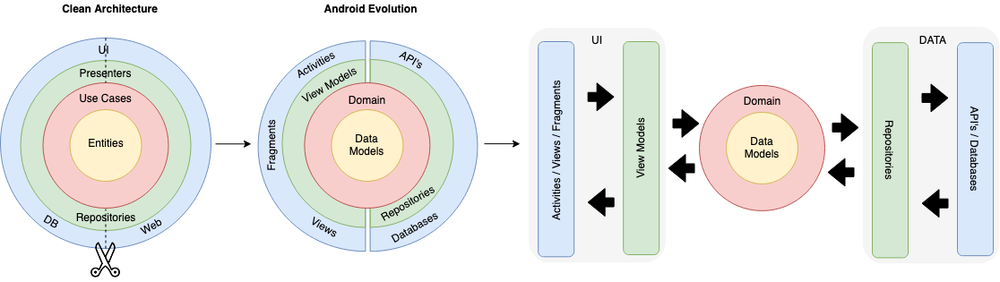
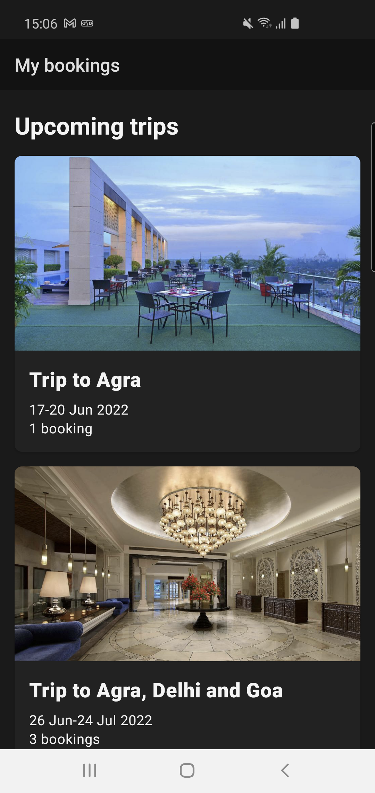
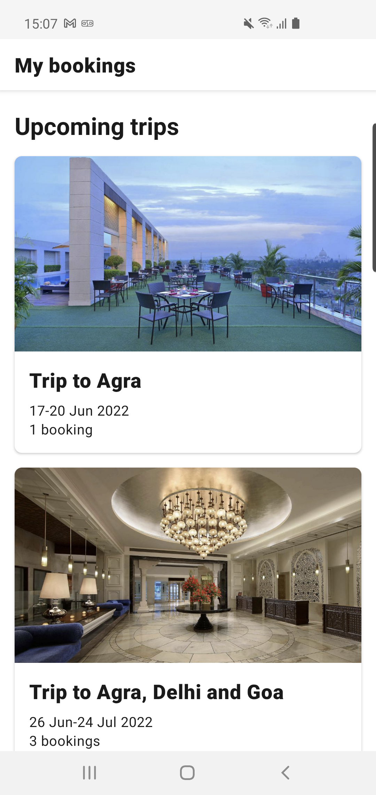

# My Bookings Application

It's an app built using the Clean Architecture and MVVM patter for presentation layer. The app
allows you to check your upcoming and past bookings.

## Index

- [Architecture](#architecture)
- [Screenshots](#screenshots)
- [Testing](#testing)
- [Libraries](#libraries)
- [Building Tips](#building-tips)
- [Improvements](#improvements)

## Architecture

The app is built using
the [Clean Architecture](https://blog.cleancoder.com/uncle-bob/2012/08/13/the-clean-architecture.html).

The following diagram shows the structure of this project with 3 layers:

- Presentation
- Domain
- Data

### Domain Layer

Domain Layer contains:

- **Business Models** - Models for business logic.
- **Repositories** - Repository definitions(Dependency Inversion principle). But the realisation was provided by Booking. I didn't refactor it.
- **UseCases** - These represent the user interactions with the system and contain business logic.

### Data Layer

Data layer contains locale data source implementations, repository implementation, mappers and data
models.

### Presentation Layer

This layer contains all the platform specific, i.e. Android, code. It is responsible for User
Interface and handling user actions.

## Screenshots

## Testing

Tests contain:
- **Unit Tests**

### Testing Libraries:

- **JUnit4** - Standard Unit testing library.
- **Mockk** - Library for mocking.
- **Kotlin coroutines** - Library for work with coroutines test.
- **Turbine** - Library for testing flows.

## Libraries

- **AndroidX Lifecycle** - Standard android lib(Lifecycle, ViewModel, LiveData).
- **Recyclerview** - Recyclerview Lib. Standard android library.
- **ConstraintLayout** - ConstraintLayout Lib. Standard android library.
- **Hilt** - Dependency Injection. From my perspective it's easier library for implementing DI.
- **Navigation** - Android Navigation Lib.
- **Glide** - Image loading Lib. It provides images caching from the box and a lot of useful functionality.
- **Material Design** - Material Design components.

## Building Tips

1. If you can't run  the application you should change your JDK version. You can do it here: Android Studio | Preferences | Build, Execution, Deployment | Build Tools | Gradle.
   Please choose 11 version of JDK.
2. Invalidate Cashes/ Restart

## Improvements

- Improve algorithm.
- Improve test coverage.